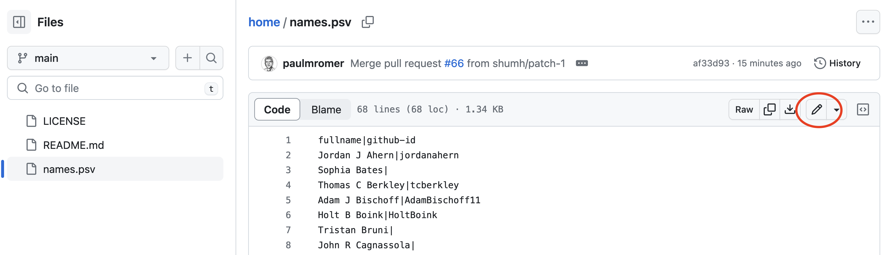
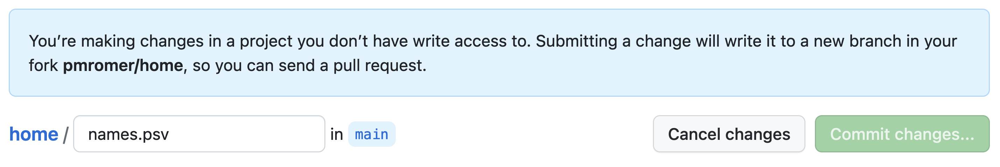
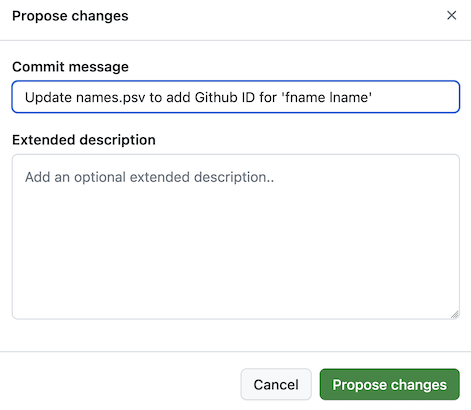
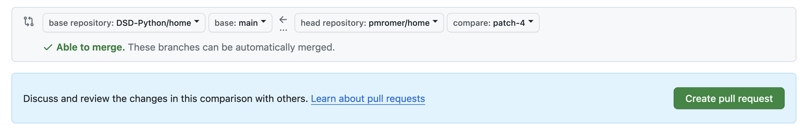

# home

Home page for the DSD Course and the DSD-Python organization

Everything we do in this organization will be an experiment! 

The only file in this repository is `names.psv`, which has the full name of each student in the course (as shown on Canvas) and your github ID. 

The extension `.psv` suggests "pipe separated values." It is like "comma separated values" but with the pipe (or vertical line) as the separator. The more common practice seems to be to use the extension `.csv` even when the comma is not the separator. I'll leave this as `.psv` as a reminder that extensions are mainly tips for human readers, not something that code relies on. 


# How to enter your Github ID 

If you are taking the DSD-Python course, please follow the steps outlined below to add you Github ID to the `names.psv` file that the instructor and TA have access to, the one that is in the home repository. 

The steps you have to follow to do this may seem confusing because there is a specialized vocabulary for using distributed version control software. Here is a quick translation of some basic terms you'll encounter on the Github site:

```
    Repository        <=> Folder w files and subdirectories (stored in the 
                            cloud or on your machine)

    Fork              <=> Make a copy (typically in the cloud) of a repository
    
    Commit            <=> Save changes that you make to a file in a respository 
    
    Pull Request      <=> Ask that changes to a file in your copy of the repository be 
                            incorporated into the file with same name that is saved 
                            in the original repository.
```

There is much more that one can do with version control software. For example, you can sync a copy of the repository/folder that you will create on Github.com with a version on your local machine. Don't worry about any of that for now.

Using these terms, here are the steps you need to follow: 

### 1. Log into github, then go to the repo for the organization/course at this URL:

    `https://github.com/DSD-Python/home`

Click on the link for the file `names.psv`. As long as you are logged into Github, you will see something like this image below: 



### 2. Click on the pencil, which is circled in red in the image above. Github will then show you this notice: 



The only difference is that it will show your Github ID in place of the one for me that I used to generate this image. Below the message box there is a commit button that will be greyed out (i.e. inactive) until you edit the file. Once you make some changes, the button will be active. 


### 3. Edit the file 

The edit you need to make is to add your Github ID on the line that already has your name. (If there is no line with your full name, on a new line in the file, please enter what Canvas thinks is your full name, follow that with the pipe character   |   that looks like a vertical line, then add your Github ID.

If you are not sure what your Github ID is, go to your profile page and look at the URL. Your Github ID is the part of the URL that comes after "Github.com." For example, the URL for my profile for my main Github ID is 

    https://github.com/paulmromer 

So I know that paulmromer is my Github ID.


### 4. Commit your changes 
After you make your edit, the `Commit changes` button will be active. Click on it. Next you be presented with a form that lets you include a "Commit message" along with your commit. This can have both a short title and a longer description. Just add a short title that is informative, for example by filling in the form like this (but of course with first name and last name.) 




### 5. Make a pull request 
After you submit this by clicking on the `Propose changes` button, you will see a page that includes a section that looks like this: 



You create a `pull request` by clicking on the green button. 


### 6. What happens after you submit your pull request 
After you make your pull request, someone with admin rights for the home repository (either Paul Romer or the TA Domingos Seward) will approve your request, which means that your changes will be added to the `names.psv` file. One of us will then send to your Github ID an invitation to become a member of the DSD-Python organization. Once you are a member, you will have new permissions that will be important as we do the work of the course. 

### 7. The plan going forward 

Here are examples of things you might be able to do once you are a member of DSD-Python 

- Sync a workspace for JupyterLab on your laptop with a repository in the DSD-Python organization. This will let you get download new '.ipynb' or '.py' files from a read-only repository. 

- Create a private repository that by default, only you can see. This might be in the DSD-Python organization or under your Github ID. 

- Perhaps add Paul Romer (paulmromer) or Domigos Seward (domingos-seward) as collaborators. Then they can see the work you have done and offer comments or suggestions. 

- Create repositories and add some of your classmates as collaborators. You might want to do this if you are part of a team that is working on a project. 

- Publish a repository so that it is visible to all members of the organization/course or even to anyone with web access. 

Github.com puts some limits on what we can do with the type of free organizational account that we are using. Some of the options that I've listed above may turn out not to be available, which means that we will have to improvise. But no matter, we'll find a way to do the work of the course and learn more about what it is like to use "distributed version control software" to do knowledge work as a member of a team. 


